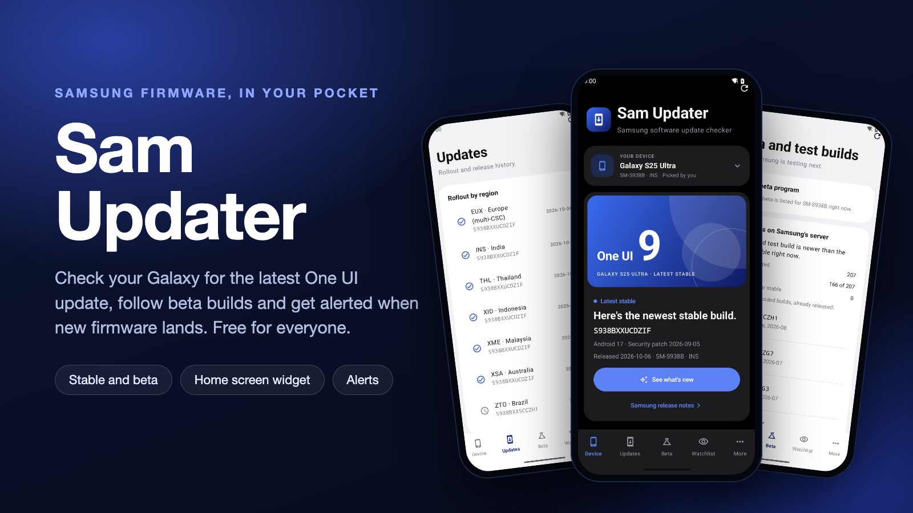
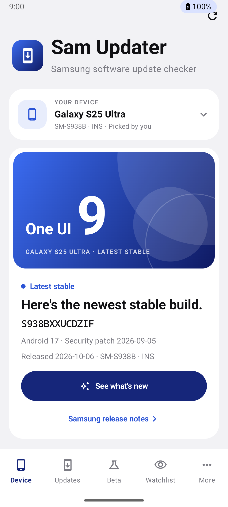
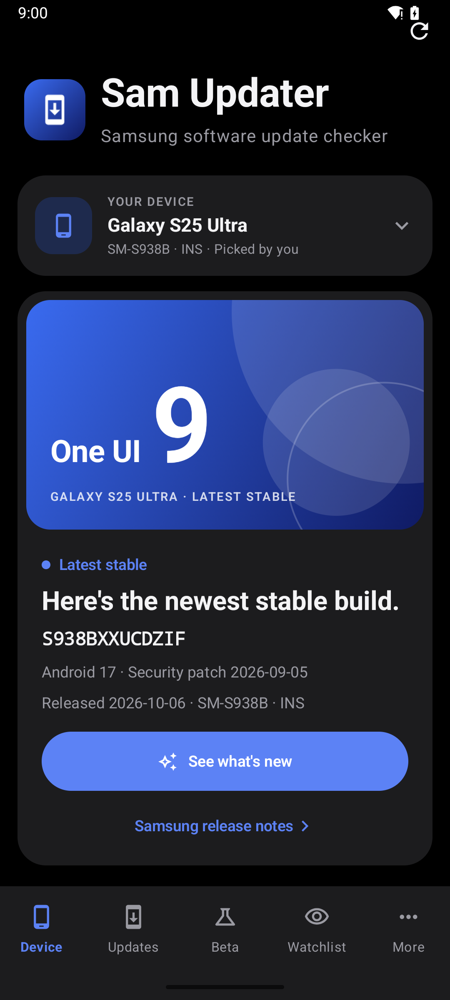
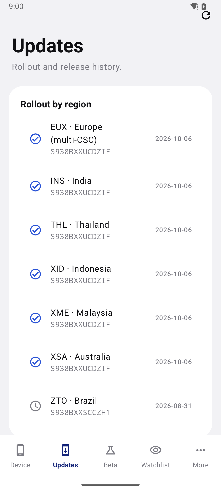
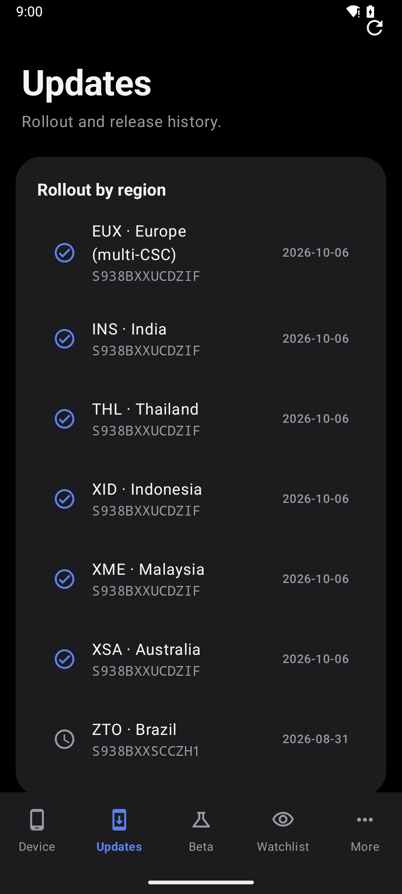
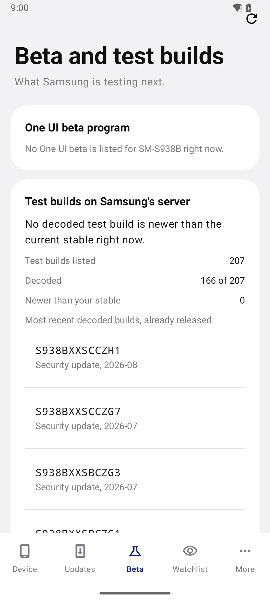
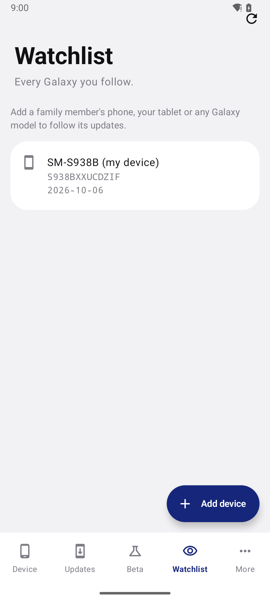
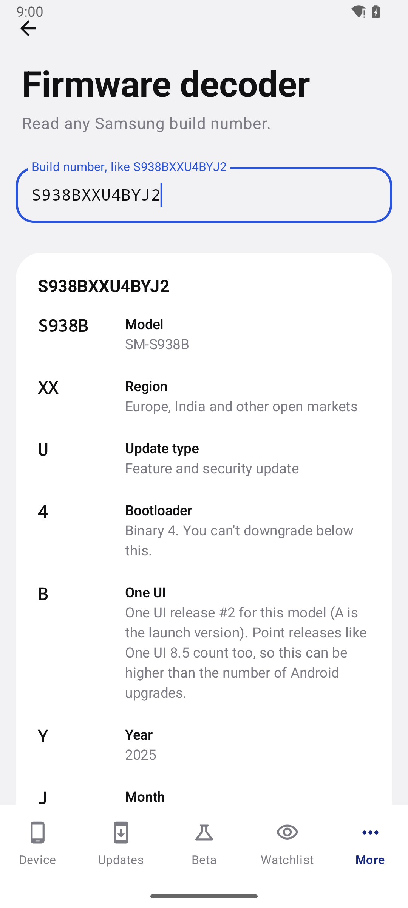
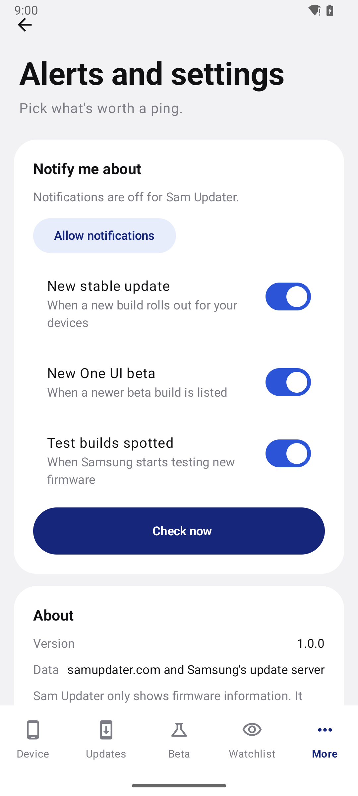
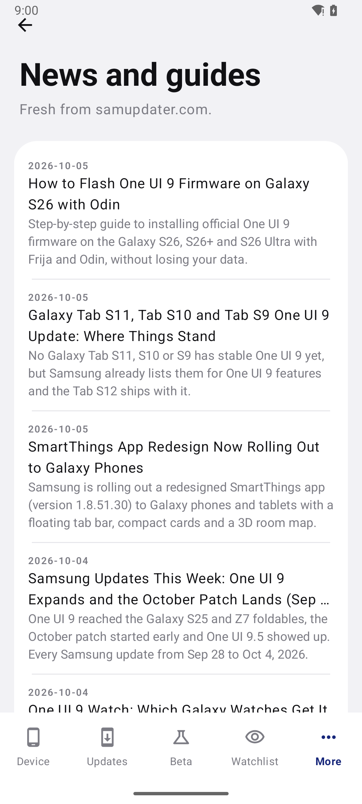

# Sam Updater



Sam Updater is a free Android app that tells you when a new firmware build is out for your Galaxy. That covers stable One UI updates, One UI beta builds and the test builds Samsung's servers show before anything goes public.

[Download the latest APK](https://github.com/Dibyajyotikabi/samupdater-app/releases/latest)

This repo also has a small WordPress plugin. It serves the app a catalog of models, beta programs and upcoming releases, so the list can change without a new app release. More guides and trackers live on [samupdater.com](https://samupdater.com/).

## Screenshots

|  |  |  |
|:-:|:-:|:-:|
| <br><sub>Device</sub> | <br><sub>Device in dark mode</sub> | <br><sub>Updates by region</sub> |
| <br><sub>Updates in dark mode</sub> | <br><sub>Beta and test builds</sub> | <br><sub>Watchlist</sub> |
| <br><sub>Firmware decoder</sub> | <br><sub>Alerts and settings</sub> | <br><sub>News and guides</sub> |

## What you get

### Device

The Device tab shows your phone, the newest stable build for your model and region, and the security patch date. Tap See what's new for the release notes.

### Updates

Updates shows the rollout by region. Each row has a region code, the build that region is on, the security patch and the date. Regions on the newest build sort to the top.

### Beta

The Beta tab shows the test builds Samsung's server lists for your model and region. It decodes the ones it can and tells you whether any are newer than your stable build. Builds in a format it can't read yet are counted separately.

### Watchlist

Follow more than one phone. Add a family member's Galaxy, or a tablet, and the app checks it along with your own device.

### Alerts

The app checks for updates in the background, about every 8 hours, whenever your phone is online. When something new shows up, it sends a notification.

You pick what you want to hear about: a new stable update, a new One UI beta or test builds spotted. Test builds use a quiet channel, so they don't buzz every time.

You can also tap Check now in Alerts and settings to run a check right away.

### Home screen widget

The Firmware status widget shows your installed build next to the latest one. If you haven't picked a device yet, it asks you to open the app first.

### Firmware decoder

Open More and tap Firmware decoder. Type a build number like `S938BXXU4BYJ2` and the app breaks it into parts, with a line explaining each one. You'll find your build number in Settings > About phone > Software information > Build number.

### News and guides

The News and guides screen pulls the latest posts from samupdater.com, so you can read them without leaving the app.

## Install the APK

1. Open the [latest release](https://github.com/Dibyajyotikabi/samupdater-app/releases/latest) on your phone and download `SamUpdater-v1.0.0.apk`.
2. Check the file if you want to be sure it arrived intact. The SHA-256 for v1.0.0 is `970a51e82c7a3c3ed7de1a24cb069dfde153595c3213f4e97f6c84c004d0e7ee`. On macOS or Linux, run `shasum -a 256 SamUpdater-v1.0.0.apk`. On Windows, run `certutil -hashfile SamUpdater-v1.0.0.apk SHA256`.
3. Tap the file. Android will ask you to allow installs from that app, like your browser or file manager. Turn it on, go back and tap Install.
4. Open Sam Updater.

Requirements:

- Android 8.0 (API 26) or newer
- An internet connection for checks
- Notification permission if you want alerts. Android 13 and newer asks for it.

## Set it up

1. Open the app. On a Galaxy, it reads your model on its own. On any other phone, or if it misses, tap Pick your device and choose your model. Then enter your CSC, the three-character region code like INS or EUX.
2. Read the Device tab. That's your newest stable build, with its security patch. Tap See what's new for the release notes.
3. Go to More, then Alerts and settings. Tap Allow notifications and choose the alerts you want.
4. Add family phones on the Watchlist tab.
5. Add the widget. Long-press an empty spot on your home screen, tap Widgets, then pick Firmware status from the Sam Updater list.

The app doesn't install firmware. It only tells you what's out there. To update your phone, use Settings > Software update > Download and install on the phone itself.

## WordPress plugin

The plugin lives in `wordpress-plugin/samupdater-app-api`. It adds one read-only endpoint to samupdater.com:

```
GET /wp-json/samupdater-app/v1/catalog
```

The catalog holds the things Samsung's servers don't tell the app:

- Devices: each model's name, the Android version it launched with and how many OS upgrades it gets. The security update tier and how long security updates are promised are optional. Some models, like the Galaxy A-series, don't list a tier yet.
- Beta programs: the One UI beta status for each model family, the latest beta build and the countries it runs in.
- Upcoming: major One UI releases that are on the way, with their stage and a link.
- CSC suggestions: the region codes shown in the device picker.

The plugin needs WordPress 6.0 or newer and PHP 7.4 or newer. It's licensed under GPL-2.0-or-later.

To install it:

1. Zip the `samupdater-app-api` folder, leaving out the `tests` folder.
2. In WordPress, go to Plugins > Add New > Upload Plugin and upload the zip.
3. Activate it. The catalog is seeded from `data/catalog-seed.json`.
4. Edit the catalog under Settings > Sam Updater App. Every save is validated first, so a typo can't break the app. If something is wrong, the page lists the problems and keeps your text in the box.
5. Open `https://samupdater.com/wp-json/samupdater-app/v1/catalog` to check that it works.

Responses carry `Cache-Control: public, max-age=900`, so a page cache or CDN can serve them. Each IP gets 60 requests a minute. The limit counts the connecting address, so if your site sits behind a proxy or CDN, many visitors can share one address. In that case, raise the limit with a filter:

```php
add_filter( 'samupdater_app_api_rate_limit', fn() => 120 ); // 0 turns the limit off
```

Firmware lookups don't go through the plugin. The app talks to Samsung's update servers directly. The app also keeps a copy of the catalog, so it still works when samupdater.com can't be reached.

## Look and feel

Body text uses your phone's system font, so the app matches the rest of your phone. Headings are bold, and labels are a little heavier.

Build numbers use a monospace font. Every character takes the same width, so `S938BXXU4BYJ2` is easy to read and compare letter by letter.

The app doesn't ship any font files. It uses the fonts already on your phone.

## Build from source

```bash
git clone https://github.com/Dibyajyotikabi/samupdater-app.git
cd samupdater-app/android
./gradlew testDebugUnitTest
./gradlew assembleDebug
```

You need JDK 17 and the Android SDK for API 35. Android Studio can set up both. On Windows, use `gradlew.bat` in place of `./gradlew`.

A release build is signed only if you provide a signing config. The build reads `storeFile`, `storePassword`, `keyAlias` and `keyPassword` from `~/.samupdater/keystore.properties`. If that file is missing, `./gradlew assembleRelease` gives you an unsigned APK. Signing keys are never committed to this repo.

## Project layout

- `android/` is the Android app, written in Kotlin with Jetpack Compose and Material 3.
- `wordpress-plugin/` holds the catalog plugin for WordPress.
- `screenshots/` has the images used in this README.

## Good to know

Sam Updater is an independent project. It isn't made by, endorsed by or affiliated with Samsung. Galaxy and Samsung are trademarks of Samsung Electronics.

## License

The WordPress plugin is licensed under GPL-2.0-or-later, as stated in its `readme.txt`. The Android app doesn't have a license file yet.

That's the whole thing. Got a question or found a bug? Open an issue and tell me your Galaxy model number and One UI version. The more context you give, the easier it is to help.
